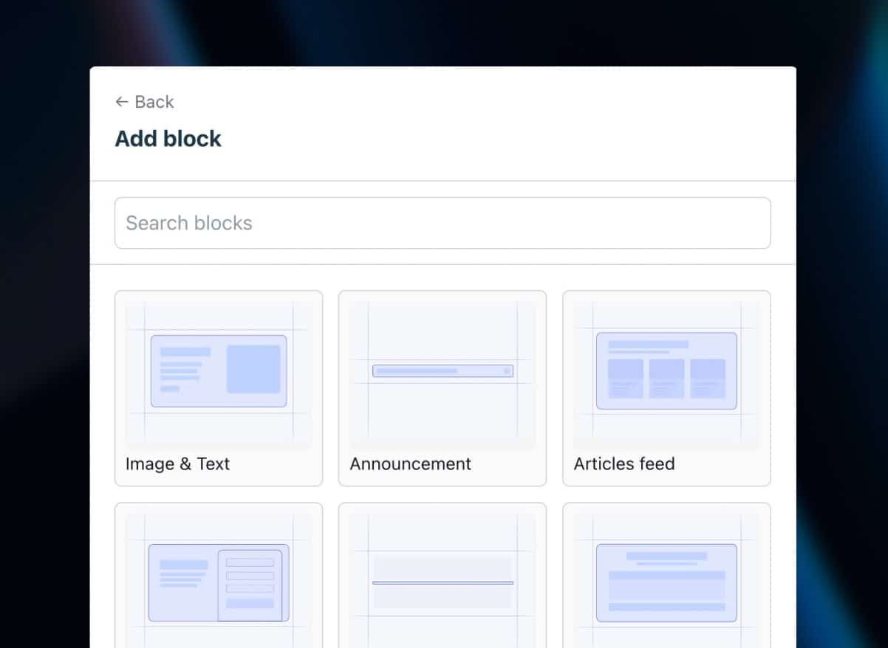

# Blocks

Blocks are reusable components that make up a page. Each block represents a section of content that users can add, configure, and arrange.

## Blocks and Themes

Blocks are organized within themes. Each theme has its own `blocks/` directory containing theme-specific blocks. This allows you to create different sets of blocks for different themes.

## Creating a Block

Blocks are Vue components located in your theme's `blocks/` directory. Each block should be in its own directory:

**For a single theme setup (using `default`):**

```
src/page-builder/
  default/
    blocks/
      hero/
        Hero.vue
        fields.ts      # Optional
        thumbnail.png  # Optional
```

**For multiple themes:**

```
src/page-builder/
  default/
    blocks/
      hero/
        Hero.vue
  marketing-theme/
    blocks/
      hero/
        Hero.vue
      cta-section/
        CtaSection.vue
```

## Block Component Structure

A block component is a standard Vue component that **should** define a `label` in `defineOptions` for display in the editor:

```vue
<template>
   <section class="hero-section">
      <h1>{{ heading }}</h1>
      <p>{{ description }}</p>
   </section>
</template>

<script setup lang="ts">
defineOptions({
   label: "Hero Section", // Used for display in the block browser
});

defineProps<{
   heading: string;
   description: string;
}>();
</script>
```

### Label in defineOptions

The `label` property in `defineOptions` is used to display the block name in the editor's block browser. While not strictly required (the block will still work without it), providing a label improves the user experience by showing a friendly name instead of the block type.

```vue
<script setup lang="ts">
defineOptions({
   label: "Hero Section", // Display name in block browser
   // Optional: emoji for visual identification
   emoji: "🎯",
});
</script>
```

**Benefits:**

- **Better UX** - Users see friendly names like "Hero Section" instead of "heroSection"
- **Consistency** - Matches the pattern used by layouts
- **Accessibility** - Clearer identification for screen readers

## Block Naming Convention

- Block directories should use **kebab-case** (e.g., `hero-section`)
- Block components should use **PascalCase** matching the directory name (e.g., `HeroSection.vue`)
- The library automatically matches block types to components using name variations
- **Recommended:** Use `defineOptions` with a `label` property for display in the editor

## Block Fields

Blocks can define editable fields using a `fields.ts` file. See the [Fields Guide](/guide/fields) for more information.

## Block Thumbnails

Blocks can include a thumbnail image that displays in the "add block" list in the editor sidebar. The library automatically looks for a `thumbnail.png` file in each block's directory.



### Adding a Thumbnail

Place a `thumbnail.png` file in your block directory:

```
src/page-builder/
  default/
    blocks/
      hero/
        Hero.vue
        fields.ts
        thumbnail.png  ← Add thumbnail here
```

The thumbnail will be automatically displayed in the block browser when users are selecting blocks to add. Recommended size is approximately 112px height (the display area is 112px tall with auto width).

### Thumbnail Fallback

If no `thumbnail.png` is found, the library will fall back to:

1. **Emoji** - If the block defines an `emoji` property in `defineOptions`
2. **Placeholder icon** - A default icon if neither thumbnail nor emoji is available

Example with emoji fallback:

```vue
<script setup lang="ts">
defineOptions({
   label: "Hero Section",
   emoji: "🎯", // Used if thumbnail.png is not found
});
</script>
```

## Theme-Specific Blocks

Blocks are scoped to their theme. When you use a theme, only blocks from that theme's `blocks/` directory are available. This allows you to:

- Create different block sets for different use cases (e.g., marketing blocks vs. blog blocks)
- Organize blocks by theme functionality
- Maintain separate block libraries for different themes

To learn more about themes, see the [Themes Guide](/guide/themes).
