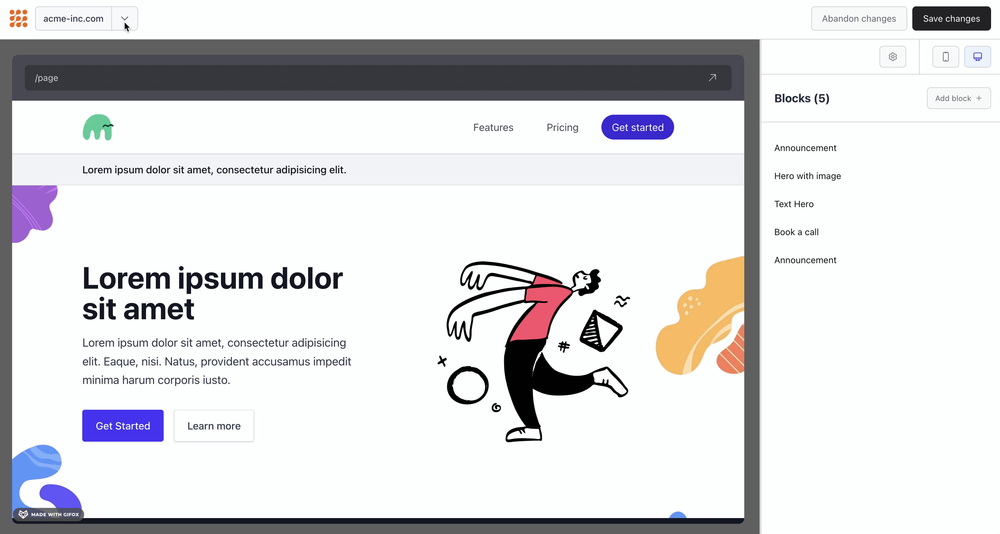

# Themes

Themes allow you to organize blocks, layouts, and fields into cohesive collections, similar to WordPress or Squarespace themes. This enables you to create multiple page themes for greater control over look, feel, and functionality.

## Overview

Themes are autodiscovered by the `vue-wswg-editor` library. Each theme is a directory containing its own blocks, layouts, and optionally custom fields. If no theme is provided, the library falls back to a `default` theme directory.

**Key Points:**

- Themes are **not stored** in `pageData` - they should be handled separately by your application
- Themes are provided to components via the `theme` prop
- Themes allow you to set the theme at a higher settings level and store it separately in your database
- This enables applying the same theme to multiple pages

## Theme Directory Structure

Themes are organized as directories within your `page-builder` folder:

```
src/page-builder/
├── default/              # Default theme (fallback if no theme specified)
│   ├── theme.config.js
│   ├── thumbnail.jpg     # Optional theme thumbnail
│   ├── blocks/
│   │   ├── hero/
│   │   └── feature-grid/
│   ├── layout/
│   │   ├── default.vue
│   │   └── marketing.vue
│   └── fields/           # Optional: theme-specific custom fields
│       └── rich-text/
├── marketing-theme/      # Another theme
│   ├── theme.config.js
│   ├── thumbnail.jpg
│   ├── blocks/
│   └── layout/
└── minimal-theme/        # Yet another theme
    ├── theme.config.js
    ├── thumbnail.jpg
    ├── blocks/
    └── layout/
```

## Creating a Theme

### 1. Create Theme Directory

Create a directory for your theme inside the `page-builder` folder:

```
src/page-builder/my-theme/
```

### 2. Create Theme Configuration

Create a `theme.config.js` file in your theme directory:

```javascript
// src/page-builder/my-theme/theme.config.js
export default {
   title: "My Theme",
   description: "A custom theme with unique blocks and layouts",
   version: "1.0.0",
   author: "Your Name",
   authorWebsite: "https://example.com",
   tags: ["custom", "modern", "responsive"],
   license: "MIT",
};
```

### 3. Add Theme Thumbnail (Optional)

Add a `thumbnail.jpg` or `thumbnail.png` file to your theme directory:

```
src/page-builder/my-theme/
├── theme.config.js
├── thumbnail.jpg    # Theme thumbnail for selection UI
├── blocks/
└── layout/
```

### 4. Add Blocks and Layouts

Create your theme's blocks and layouts:

```
src/page-builder/my-theme/
├── theme.config.js
├── thumbnail.jpg
├── blocks/
│   ├── hero/
│   │   ├── Hero.vue
│   │   ├── fields.ts
│   │   └── thumbnail.png
│   └── feature-grid/
│       ├── FeatureGrid.vue
│       └── fields.ts
└── layout/
    ├── default.vue
    └── marketing.vue
```

## Using Themes

### With WswgPageBuilder

Pass the theme ID to the `WswgPageBuilder` component:

```vue
<template>
   <WswgPageBuilder v-model="pageData" :theme="currentThemeId" :editable="true" />
</template>

<script setup lang="ts">
import { ref } from "vue";
import { WswgPageBuilder } from "vue-wswg-editor";

const currentThemeId = ref("my-theme"); // Theme ID from your application state
const pageData = ref({
   blocks: [],
   settings: { layout: "default" },
});
</script>
```

### With PageRenderer

Pass the theme ID to the `PageRenderer` component:

```vue
<template>
   <PageRenderer
      :blocks="pageData.blocks"
      :layout="pageData.settings.layout"
      :settings="pageData.settings"
      :theme="currentThemeId"
   />
</template>

<script setup lang="ts">
import { PageRenderer } from "vue-wswg-editor";

const currentThemeId = ref("my-theme");
const pageData = ref({
   blocks: [],
   settings: {},
});
</script>
```

## Theme Discovery

Themes are automatically discovered by the library. The library scans your `page-builder` directory for directories containing a `theme.config.js` file.

### Fallback Behavior

If no theme is provided (or if the specified theme doesn't exist), the library will:

1. Look for a `default` theme directory
2. If no `default` theme exists, use the first available theme
3. Log a warning if no themes are found

## Getting Available Themes

Use the `getThemes()` utility to fetch all available themes:

```vue
<script setup lang="ts">
import { getThemes, type Theme } from "vue-wswg-editor";

const themes = getThemes();
// Returns: Theme[]
// [
//   {
//     id: "default",
//     path: "@page-builder/default",
//     title: "Default Theme",
//     description: "...",
//     version: "1.0.0",
//     author: "...",
//     tags: [...],
//     ...
//   },
//   ...
// ]
</script>
```

## Getting Theme Thumbnails

Use the `getThemeThumbnail()` utility to get the thumbnail URL for a theme:

```vue
<script setup lang="ts">
import { getThemes, getThemeThumbnail } from "vue-wswg-editor";

const themes = getThemes();

// Get thumbnail for a theme
const thumbnailUrl = getThemeThumbnail(themes[0].path);
// Returns: string | undefined
</script>
```

## Theme Selection UI

You can build a theme selection interface using `getThemes()` and `getThemeThumbnail()`. See the [Theme Selection Example](/examples/theme-selection) for a complete implementation.



## Storing Themes in Your Application

Since themes are not stored in `pageData`, you should handle them separately:

### Application-Level Storage

Store the theme ID at the application or site level:

```typescript
// Application settings (stored separately from pages)
interface AppSettings {
   themeId: string; // e.g., "my-theme"
   // ... other app settings
}

// Page data (doesn't include theme)
interface PageData {
   blocks: Block[];
   settings: {
      layout: string;
      // ... other page settings
   };
}
```

### Database Schema Example

```sql
-- Application settings table
CREATE TABLE app_settings (
   id INT PRIMARY KEY,
   theme_id VARCHAR(255) NOT NULL DEFAULT 'default',
   -- ... other settings
);

-- Pages table (theme not stored here)
CREATE TABLE pages (
   id INT PRIMARY KEY,
   title VARCHAR(255),
   page_data JSONB, -- Contains blocks and settings, but not theme
   -- ...
);
```

### Using with Pinia/Vuex

```typescript
// stores/app.ts
import { defineStore } from "pinia";

export const useAppStore = defineStore("app", {
   state: () => ({
      themeId: "default",
   }),
   actions: {
      setTheme(themeId: string) {
         this.themeId = themeId;
         // Save to database
         this.saveThemeToDatabase(themeId);
      },
      async saveThemeToDatabase(themeId: string) {
         await fetch("/api/settings/theme", {
            method: "PUT",
            headers: { "Content-Type": "application/json" },
            body: JSON.stringify({ themeId }),
         });
      },
   },
});
```

## Benefits of Theme-Based Architecture

1. **Separation of Concerns**: Themes are separate from page content, allowing you to change themes without affecting page data
2. **Reusability**: Apply the same theme to multiple pages
3. **Organization**: Group related blocks and layouts together
4. **Flexibility**: Create different themes for different use cases (marketing, blog, e-commerce, etc.)
5. **Easy Updates**: Update a theme's blocks/layouts and all pages using that theme will reflect the changes

## Single Theme Setup

If you're only using one theme, simply create a `default` theme directory:

```
src/page-builder/
└── default/
    ├── theme.config.js
    ├── blocks/
    └── layout/
```

The library will automatically use this theme when no theme is specified.

## See Also

- [Theme Selection Example](/examples/theme-selection) - Complete theme selection UI example
- [Blocks Guide](/guide/blocks) - Learn about creating blocks within themes
- [Layouts Guide](/guide/layouts) - Learn about creating layouts within themes
- [Fields Guide](/guide/fields) - Learn about fields within themes
- [Components Guide](/guide/components) - Learn about using themes with components
